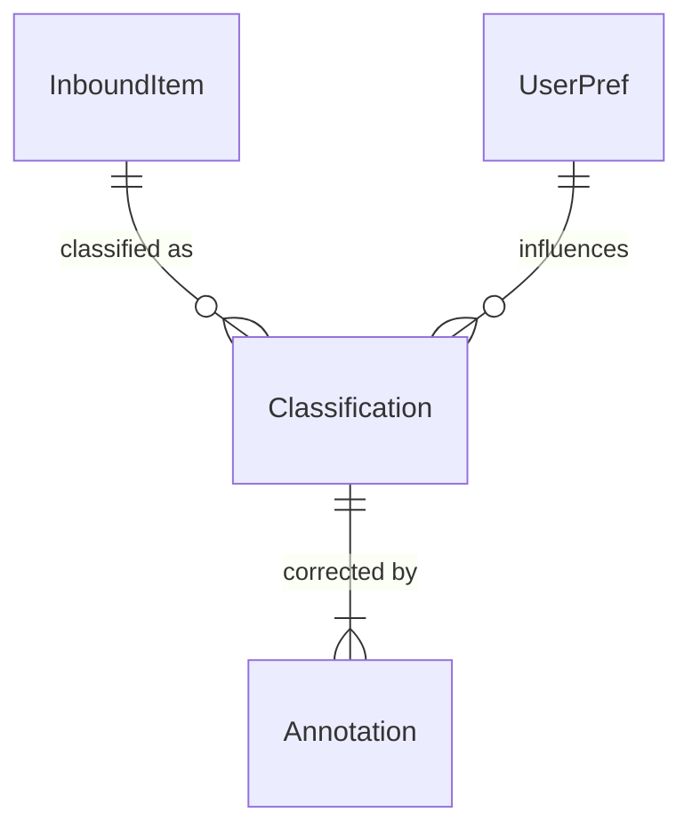

# Smart Document & Feed Unification Processor

*Dynamic, self‑tuning architecture*

> **Why this doc?**
> To articulate how the solution stays easy to onboard **and** easy to change—every rule, threshold, and model weight is *data*, not code. User interactions act as signals that automatically trigger retraining or configuration updates.

---

## 1  Guiding Design Principles

| Principle                    | Manifestation                                                                                                                                                                                                                                                                                                                                                                                                                           |
| ---------------------------- | --------------------------------------------------------------------------------------------------------------------------------------------------------------------------------------------------------------------------------------------------------------------------------------------------------------------------------------------------------------------------------------------------------------------------------------- |
| **Event‑driven decoupling**  | Every stage publishes a domain event on **Amazon EventBridge**; downstream consumers can be added or removed without redeploying producers. This pattern speeds change and isolates blast‑radius ([aws.amazon.com](https://aws.amazon.com/blogs/architecture/best-practices-for-implementing-event-driven-architectures-in-your-organization/?utm_source=chatgpt.com)).                                                                 |
| **Config‑as‑data**           | Routing logic, feature flags, confidence thresholds, and even active model ARNs live in **AWS AppConfig** or **DynamoDB** so updates propagate instantly—no pipeline redeploy ([aws.amazon.com](https://aws.amazon.com/blogs/mt/improve-your-feature-flagging-with-aws-appconfig-version-labels/?utm_source=chatgpt.com), [aws.amazon.com](https://aws.amazon.com/blogs/mt/using-aws-appconfig-feature-flags/?utm_source=chatgpt.com)). |
| **Continuous learning**      | User corrections are captured as annotations; once a nightly (or volume‑based) threshold is met, a Step Functions workflow fine‑tunes the active LLM in **Amazon Bedrock** ([aws.amazon.com](https://aws.amazon.com/blogs/aws/customize-models-in-amazon-bedrock-with-your-own-data-using-fine-tuning-and-continued-pre-training/?utm_source=chatgpt.com)).                                                                             |
| **Human‑in‑the‑loop safety** | Low‑confidence extractions are routed to a validation UI; actions in that UI feed the learning loop, just like leading IDP vendors (Hyperscience, UiPath DU) ([docs.aws.amazon.com](https://docs.aws.amazon.com/amazondynamodb/latest/developerguide/best-practices.html?utm_source=chatgpt.com)).                                                                                                                                      |
| **Pay‑per‑use economics**    | All compute is serverless (Lambda, Step Functions). Costs scale strictly with workload ([aws.amazon.com](https://aws.amazon.com/lambda/pricing/?utm_source=chatgpt.com), [wired.com](https://www.wired.com/story/promise-practically-serverless-computing?utm_source=chatgpt.com)).                                                                                                                                                     |

---

## 2  High‑Level Architecture

### Component Swim‑lane

| Flow step                     | Service                  | Notes                                                                                                                                                                                                                                                                                                                                                                       |
| ----------------------------- | ------------------------ | --------------------------------------------------------------------------------------------------------------------------------------------------------------------------------------------------------------------------------------------------------------------------------------------------------------------------------------------------------------------------- |
| **1 Ingestion**               | S3, SES, API Gateway     | E‑mail, scans, social posts land; `ingest.received` fired on EventBridge ([medium.com](https://medium.com/aws-lambda-serverless-developer-guide-with-hands/amazon-eventbridge-decouple-services-with-event-driven-architecture-9643b2f5290f?utm_source=chatgpt.com))                                                                                                        |
| **2 Classification**          | Lambda (Classify)        | Reads latest config & model ID from AppConfig; stores `Classification` item in DynamoDB ([docs.aws.amazon.com](https://docs.aws.amazon.com/amazondynamodb/latest/developerguide/best-practices.html?utm_source=chatgpt.com))                                                                                                                                                |
| **3 Human review (optional)** | Amplify/React web UI     | Users accept or correct predictions; UI emits `annotation.created` events                                                                                                                                                                                                                                                                                                   |
| **4 Rule promoter**           | Lambda (PromoteRules)    | High‑confidence patterns auto‑draft rule JSON into AppConfig for admin approval                                                                                                                                                                                                                                                                                             |
| **5 Nightly fine‑tune**       | Step Functions + Bedrock | Scheduled via EventBridge Scheduler; fine‑tunes foundation model with new annotations ([aws.amazon.com](https://aws.amazon.com/tutorials/scheduling-a-serverless-workflow-step-functions-amazon-eventbridge-scheduler/?utm_source=chatgpt.com), [medium.com](https://medium.com/%40abdullahiolaoye4/finetuning-llms-on-amazon-bedrock-887ebc547adc?utm_source=chatgpt.com)) |
| **6 Feedback metrics**        | CloudWatch & QuickSight  | Drift and accuracy dashboards; alerts can trigger AppConfig rollback                                                                                                                                                                                                                                                                                                        |

---

## 3  Data & Configuration Model

| Table / Store                 | Purpose                                        | Key schema                                                                                                                                                                        |
| ----------------------------- | ---------------------------------------------- | --------------------------------------------------------------------------------------------------------------------------------------------------------------------------------- |
| **DynamoDB `InboundItem`**    | Raw payload metadata                           | `PK = itemId`                                                                                                                                                                     |
| **DynamoDB `Classification`** | Predicted category, priority, entities         | `PK = itemId`                                                                                                                                                                     |
| **DynamoDB `Annotation`**     | User corrections                               | `PK = itemId • SK = ts`                                                                                                                                                           |
| **AppConfig profile**         | Feature flags, routing rules, active model ARN | JSON doc with semantic version labels ([aws.amazon.com](https://aws.amazon.com/blogs/mt/improve-your-feature-flagging-with-aws-appconfig-version-labels/?utm_source=chatgpt.com)) |

Each Lambda fetches the current AppConfig version at cold‑start and caches it; SDK’s built‑in polling refreshes long‑running runtimes.

---

## 4  Self‑Tuning Feedback Loop

1. **Correction captured** – User changes category from *Bills*→*Taxes*.
2. **Annotation stored** – Lambda logs the delta.
3. **Threshold met** – Either ≥ 50 new annotations or daily schedule.
4. **Fine‑tune job** – Step Functions submits training job to Bedrock.
5. **Config update** – On success, Lambda writes new model ARN + bump in `modelVersion` to AppConfig.
6. **Live traffic uses new model** – Next classification invokes updated model with zero downtime.

---

## 5  Onboarding & Change UX

* **Citizen‑developer rule builder** – Non‑technical users create “If X then route Y” rules via a visual editor that writes JSON directly to AppConfig (leveraging built‑in versioning/rollback).
* **First‑run wizard** – Guides new orgs through connecting mailboxes/scanners, seeding initial priorities.
* **Activation‑energy KPI** – Time‑to‑value target: live processing < **30 minutes** from first login.

---

## 6  Future Enhancements

* **Realtime priority re‑scoring** using a Kinesis stream of org‑level context events.
* **Embedded explainability** – Show token attributions for each extracted field so users understand *why* the model predicted a value (Gartner flags ModelOps transparency as critical ([hyperscience.ai](https://www.hyperscience.ai/resource/gartner-2024-market-guide-for-intelligent-document-processing-solutions/?utm_source=chatgpt.com))).
* **Plug‑in enrichment hooks** – Drop‑in Lambda layers for tools like PII redaction, translation, or sentiment analysis.

---

### References

1. Event‑driven best practices – AWS Architecture Blog ([aws.amazon.com](https://aws.amazon.com/blogs/architecture/best-practices-for-implementing-event-driven-architectures-in-your-organization/?utm_source=chatgpt.com))
2. AppConfig version labels & rollback ([aws.amazon.com](https://aws.amazon.com/blogs/mt/improve-your-feature-flagging-with-aws-appconfig-version-labels/?utm_source=chatgpt.com))
3. DynamoDB design best‑practices ([docs.aws.amazon.com](https://docs.aws.amazon.com/amazondynamodb/latest/developerguide/best-practices.html?utm_source=chatgpt.com))
4. Bedrock fine‑tuning overview ([aws.amazon.com](https://aws.amazon.com/blogs/aws/customize-models-in-amazon-bedrock-with-your-own-data-using-fine-tuning-and-continued-pre-training/?utm_source=chatgpt.com))
5. Scheduled Step Functions tutorial ([aws.amazon.com](https://aws.amazon.com/tutorials/scheduling-a-serverless-workflow-step-functions-amazon-eventbridge-scheduler/?utm_source=chatgpt.com))
6. Amazon Textract service page ([aws.amazon.com](https://aws.amazon.com/textract/?utm_source=chatgpt.com))
7. Lambda pay‑per‑use pricing ([aws.amazon.com](https://aws.amazon.com/lambda/pricing/?utm_source=chatgpt.com))
8. Serverless market context ([wired.com](https://www.wired.com/story/promise-practically-serverless-computing?utm_source=chatgpt.com))
9. EventBridge decoupling article ([medium.com](https://medium.com/aws-lambda-serverless-developer-guide-with-hands/amazon-eventbridge-decouple-services-with-event-driven-architecture-9643b2f5290f?utm_source=chatgpt.com))
10. AppConfig feature flag blog ([aws.amazon.com](https://aws.amazon.com/blogs/mt/using-aws-appconfig-feature-flags/?utm_source=chatgpt.com))
11. Bedrock fine‑tuning guide (Medium) ([medium.com](https://medium.com/%40abdullahiolaoye4/finetuning-llms-on-amazon-bedrock-887ebc547adc?utm_source=chatgpt.com))
12. Gartner IDP Market Guide (Hyperscience) ([hyperscience.ai](https://www.hyperscience.ai/resource/gartner-2024-market-guide-for-intelligent-document-processing-solutions/?utm_source=chatgpt.com))

---

*Last updated: 9 June 2025*
